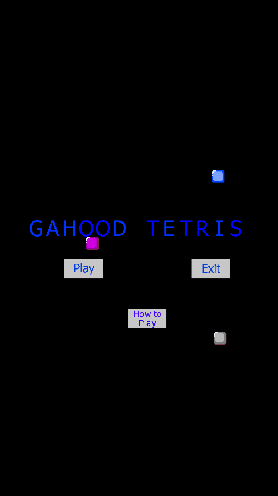
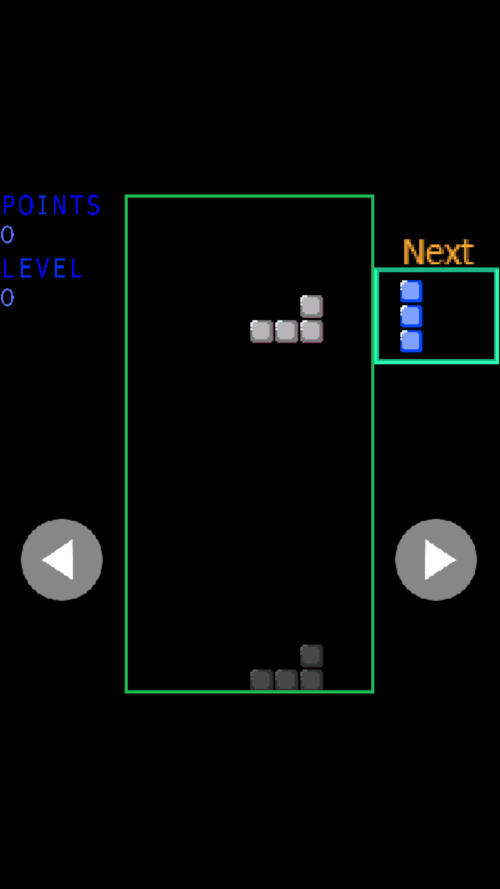
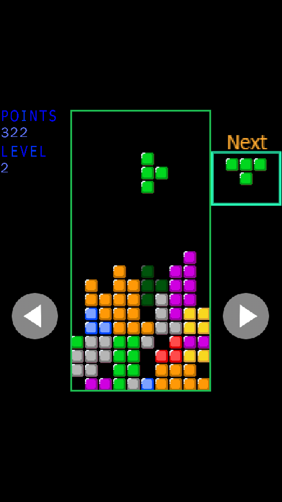

# Gahood Tetris
Gahood Tetris is my first attempt at making a game. For this project, I used C++ and SDL2 (Thanks SDL2! You guys rock!)

## What is Gahood Tetris?
Simple! It's essentially tetris but built from the ground up by me using the C++ programming language and the SDL2 library.

## What's the purpose?
Mostly because it sounded like fun, but my goal is to one day become a mobile game developer. Currently I develop mobile solution apps in Java for my company, but this project has helped me learn many important aspects of C++ and the Android NDK. 

## Installation

### **Clone**
- First clone the repository into your desired directory
``` sh
git clone 'https://github.com/dee12452/GahoodTetris.git'
```

### **Android**

- Copy SDL2 and SDL2_image source code into jni/SDL2 and jni/SDL2_image respectively
- Navigate to the project folder 
``` sh
cd Android/GahoodTetrisProject
```
- Build the project using Android NDK
``` sh
ndk-build
```
- Install using ant
``` sh
ant debug install
```
- Alternatively, you can download the release APK here: <NONE>

### **Desktop**

- Navigate to the desktop make folder
``` sh
cd Desktop/make
```
- Call make
``` sh
make
```
- Then run the binary
``` sh
./game.o
```

## --Screenshots--




